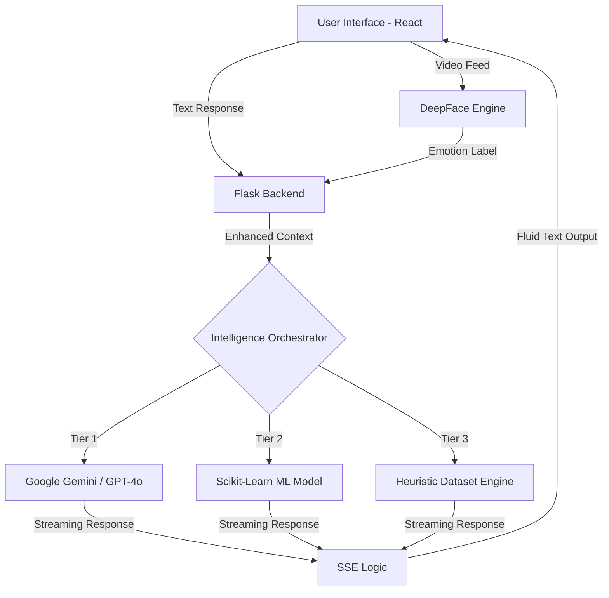

# 🌿 Mindful Companion (MindfulChat)
### *Empathetic AI for Emotional Well-being*

[](https://opensource.org/licenses/MIT)
[](https://www.python.org/)
[](https://reactjs.org/)
[](https://deepmind.google/technologies/gemini/)

Mindful Companion is a state-of-the-art mental health chatbot designed to bridge the gap between digital interaction and human empathy. By combining **Real-time Facial Emotion Recognition** with **Multi-Model Hybrid Intelligence**, it provides a safe, responsive, and emotionally aware space for users to navigate their mental well-being.

---

## 🚀 Key Highlights & Technical Innovation

### 1. 🎭 Emotional Intelligence via Computer Vision
Unlike traditional chatbots that only read text, Mindful Companion **sees** how you feel.
- **DeepFace Integration:** Analyzes user facial expressions (Happy, Sad, Anxious, Neutral) via webcam.
- **Contextual Injection:** Facial emotions are fed directly into the LLM's prompt context, allowing the AI to adjust its tone dynamically (e.g., being more gentle if sadness is detected).

### 2. 🧠 Hybrid "Fail-Safe" AI Architecture
We prioritize reliability for mental health support. The system uses a multi-tier intelligence strategy:
- **Primary:** Cloud LLMs (Google Gemini 1.5 Flash / GPT-4o) via LangChain.
- **Secondary:** Adaptive fallback to local Scikit-Learn ML classifiers if APIs are offline.
- **Tertiary:** On-device Heuristic Engine powered by a curated mental health dataset (`MentalHealthChatbotDataset.json`).

### 3. 🛡️ Clinical Safety & Ethics
- **Crisis Detection:** Hard-coded safety guardrails detect keywords related to self-harm or aggression and immediately redirect to professional help resources.
- **Scope Guarding:** AI specifically refuses coding or technical tasks, maintaining its role as a dedicated wellness companion.

### 4. 📊 Holistic Mental Health Toolkit
Beyond chat, the platform provides a comprehensive wellness suite:
- **Mood Tracker:** Interactive visualizations of emotional trends.
- **Digital Journaling:** A private space for reflection and gratitude.
- **Resource Hub:** Curated library of mental health articles and emergency contacts.

### 5. ⚡ Seamless Interaction UX
- **Real-time Streaming:** Uses **Server-Sent Events (SSE)** to stream AI responses word-by-word, creating a natural, fluid conversation without loading lag.
- **Responsive Design:** A premium interface built with **Tailwind CSS**, **Shadcn UI**, and animatons by **Framer Motion**.

---

## 🛠️ Technical Stack

| Category | Technologies |
| :--- | :--- |
| **Frontend** | React (Vite), TypeScript, Tailwind CSS, Shadcn UI, Framer Motion, Lucide Icons |
| **Backend** | Flask (Python), Gunicorn, Flask-CORS |
| **AI/ML Logic** | LangChain, Google Generative AI, GPT-4o, Scikit-Learn, Joblib |
| **Computer Vision** | DeepFace, OpenCV, TensorFlow |
| **Data/Storage** | JSON-based Heuristic Dataset, Local Model Pickles |

---

## 🏗️ Architecture Overview



---

## 📂 Project Structure

```text
mindful-companion/
├── backend/                  # Flask API & AI Logic
│   ├── app.py                # Main backend controller
│   ├── mental_health_model.pkl # Trained ML classifier
│   └── MentalHealthChatbotDataset.json # Heuristic lookup
├── frontend/                 # React Dashboard
│   ├── src/components/       # UI Components (FaceScanner, Chat)
│   ├── src/pages/            # View logic
│   └── tailwind.config.js    # Styling configuration
└── README.md                 # Presentation Documentation
```

---

## 🏁 Getting Started

### Backend Setup
1. `cd backend`
2. `python -m venv .venv` && `source .venv/bin/activate`
3. `pip install -r requirements.txt`
4. Create `.env` with `GEMINI_API_KEY` and `GITHUB_PAT`.
5. `flask run`

### Frontend Setup
1. `cd frontend`
2. `npm install`
3. `npm run dev`

---

## 🔮 Future Roadmap
- **Voice Synthesis:** Integrating real-time TTS for vocal empathy.
- **Progress Tracking:** Visualization of user mood trends over time using Recharts.
- **Wearable Integration:** Syncing with heart-rate data for physiological stress detection.

---

### 📝 Presentation Note
This project demonstrates the synergy between **Vision AI** and **Generative AI** to solve a critical human problem: accessibility to empathetic support. It is built with a focus on **privacy, availability, and human-centric design.**
#
